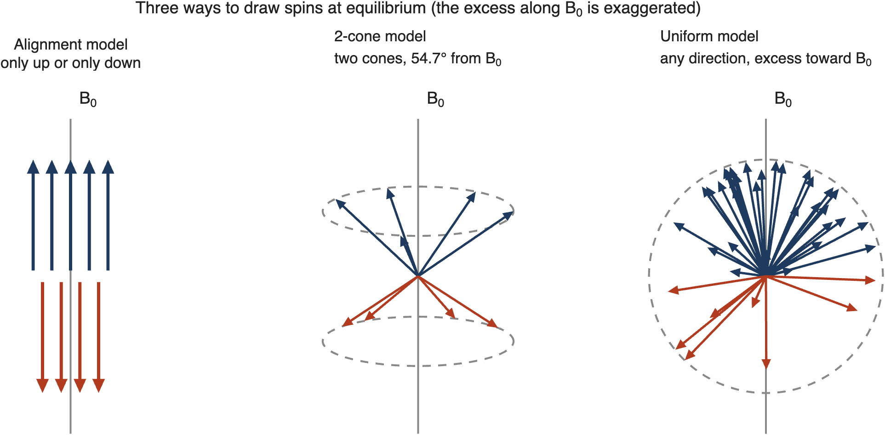
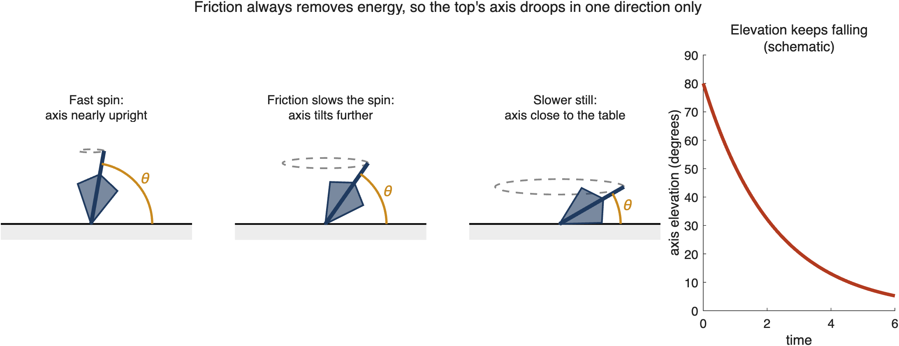
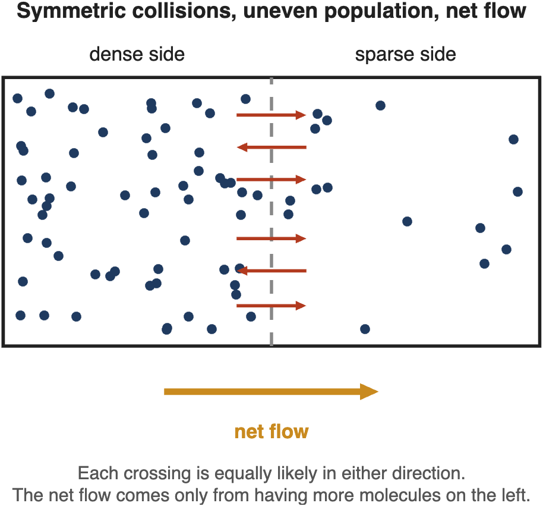
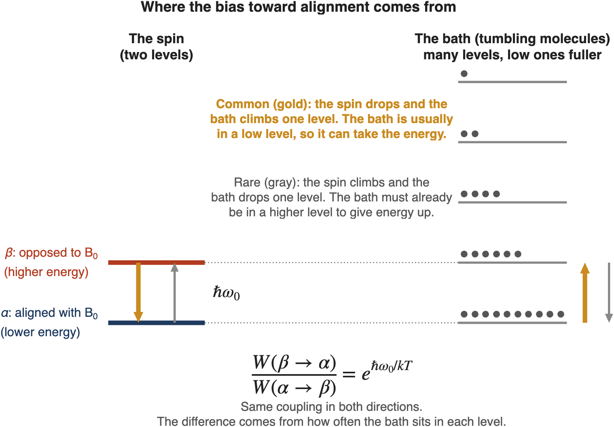
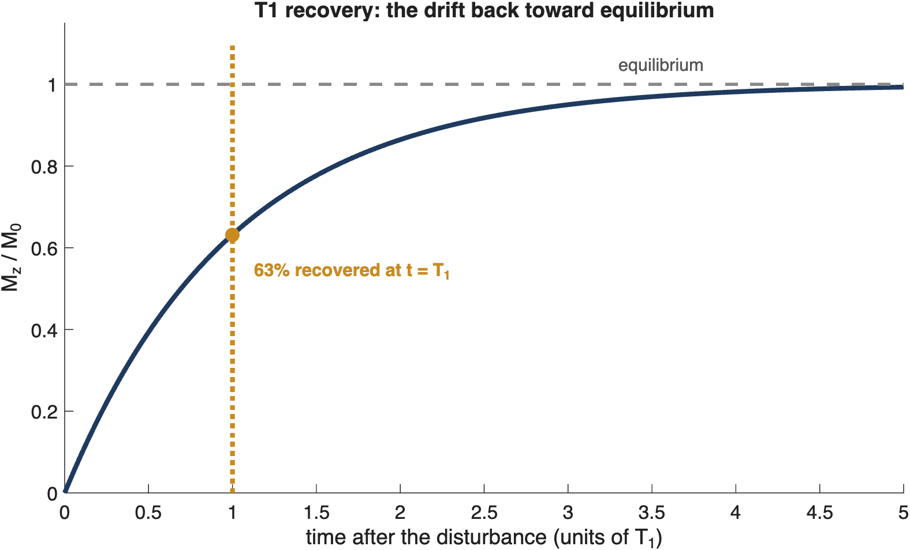
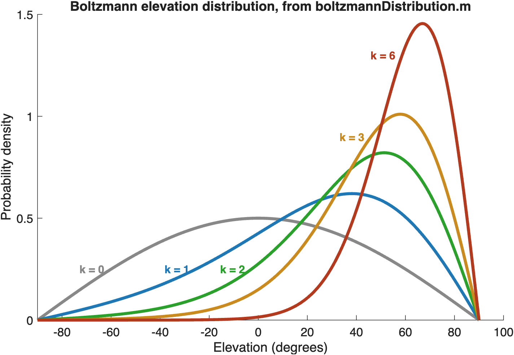
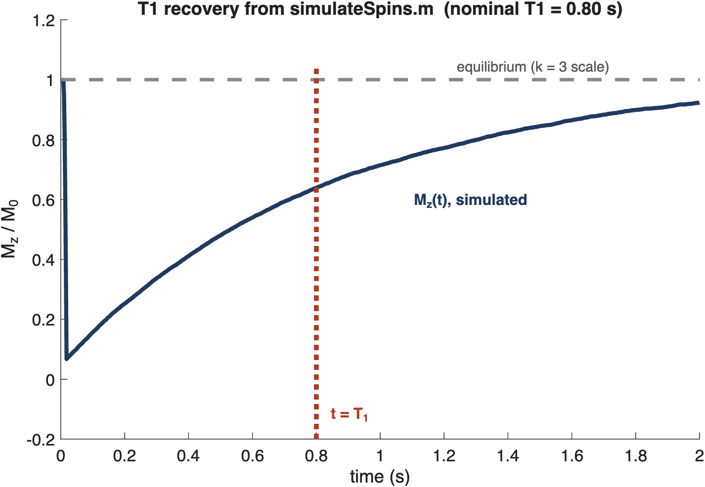
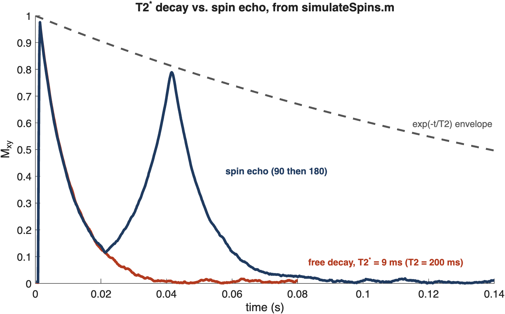

# Why Spins Relax

**Classical Pictures, Quantum Corrections, and T1**

*A summary of the classical/quantum divide in NMR, built from Williamson (2019) and Hanson (2008)*

## 1. The question underneath this whole topic

Two papers on how to teach and think about NMR — Williamson (2019, “Drawing Single NMR Spins and Understanding Relaxation”) and Hanson (2008, “Is Quantum Mechanics Necessary for Understanding Magnetic Resonance?”) — make a similar, provocative claim: understanding how nuclear spins behave in a magnetic field mostly does not require quantum mechanics. Precession, resonance, the effect of RF pulses, even the shape of the equilibrium magnetization — all of this can be pictured with a classical vector, like a bar magnet or a spinning top, and the classical picture is not a simplification. It's accurate.

Hanson marks one limit. Relaxation, he says, is consistent with classical mechanics. But the measured relaxation rates come out right only when they are calculated with quantum mechanics. Williamson goes further in the classical direction: he says the uniform model explains relaxation with no contradiction with classical behavior.

A common belief goes further than either paper. It says that no classical picture can explain why spins relax *toward* alignment with the field. This summary looks at that belief. The answer turns out to be more interesting than “classical physics fails here.” What matters is how the spin's environment is modeled. If the environment can only push the spin around, the spins never align. If the environment can also absorb energy from the spin, they do. That is true in both classical and quantum physics. Quantum mechanics is needed for the exact rates, not for the direction.

## 2. Three ways to draw a spin (Williamson)

Williamson's paper is about how NMR textbooks typically draw a single nuclear spin, and why two of the three standard pictures are actively misleading.

**The alignment model.** Spins point either straight along the field (+z) or straight against it (−z), like a two-state switch, with a slight statistical excess in the “with the field” state. This is the picture most people first learn, and it's wrong in an important way: it implies each spin sits permanently in one of two orientations, full stop.

**The 2-cone model.** Spins point somewhere on the surface of one of two cones tilted at the “magic angle” (about 54.7°) from the field, precessing around it. This one is widely used in textbooks and explains precession and phase, but it has the same underlying flaw as the alignment model — it still assumes every spin sits in one of two possible orbits — and it leads to real contradictions when you try to use it to explain what a pulse does (Williamson shows the picture has to “magically” reassemble itself in a way that doesn't correspond to any real physical process).

**The uniform model.** This is the one Williamson argues for. A spin can point in *any* direction on a sphere, with no restriction to two special cones. In the absence of a field, spin orientations are scattered uniformly over the whole sphere. Turn on the field, and nothing snaps into place — instead, each spin starts precessing around the field direction, and gradually, the population of orientations becomes slightly denser near the “north pole” (aligned with the field) than near the south pole. That slight density skew, averaged over an enormous number of spins, is the macroscopic magnetization we measure. Nothing here requires quantum discreteness — it's the picture of a swarm of gyroscopes precessing around a field, with a slow drift toward alignment layered on top.

The payoff of the uniform model, according to Williamson, is that it's the only one of the three that gives a coherent, contradiction-free account of all three basic scenarios: equilibrium, the effect of a 90° pulse, and relaxation.

*Figure 1. Three ways to draw an ensemble of nuclear spins at equilibrium — original schematic redrawings inspired by Williamson's Figs. 1–3 and Hanson's Figs. 1–3, not reproductions.*

## 3. Hanson's classical MR — and the same picture, from a different door

Hanson's paper arrives at essentially the same destination — a “spins pointing everywhere, precessing, slightly skewed toward the field” picture — but he gets there by attacking three specific myths he thinks distort how MR is taught:

- **Myth 1**: that, according to quantum mechanics, protons align either parallel or antiparallel to the magnetic field. He argues that quantum mechanics predicts no such thing. The myth comes from assuming that an MR measurement forces each proton into the “spin up” or “spin down” eigenstate. That assumption confuses a single-particle Stern-Gerlach-style measurement (which does force a collapse) with what an MR scanner does: measure the *bulk* magnetization of trillions of spins at once. That is a much gentler kind of measurement, and it doesn't collapse individual spins.

- **Myth 2**: that MR itself is “a quantum effect.” He agrees the proton's spin is a quantum property, but argues the *behavior of MR* — precession, resonance, pulses — is accurately described by classical mechanics, full stop, and doesn't need quantum reasoning to be understood.

- **Myth 3**: that an RF pulse works by “bringing spins into phase.” He shows this is inconsistent with the physics: a uniform RF field can only rotate the whole distribution of spins rigidly, it can never selectively rearrange spins relative to each other.

The physical picture Hanson lands on — spins scattered over a sphere, precessing, biased slightly toward the field by relaxation — is essentially identical to Williamson's uniform model, arrived at independently and for slightly different pedagogical reasons.

Hanson's strongest piece of support for “MR is classical” is a striking mathematical fact, due to Feynman, Vernon, and Hellwarth (1957): for an isolated two-level quantum system (like a single spin) sitting in an external field, the Schrödinger equation can be rewritten *exactly* as a classical vector precessing under a torque — the same equation that governs a classical bar magnet. This isn't an approximation or a loose analogy; for this specific problem (a closed system, no environment, no dissipation), quantum and classical descriptions are mathematically the same object viewed two ways.

## 4. Where classical physics earns its keep

Putting the two papers together, classical mechanics correctly handles:

- **Precession**: a spin in a field behaves like a gyroscope, precessing at a fixed rate (the Larmor frequency) around the field axis. No quantum reasoning needed — this is the Feynman-Vernon-Hellwarth correspondence at work.

- **Pulses and resonance**: an RF pulse tilts the whole distribution of spins by a controllable angle, the same way a classical torque would, applied on-resonance. Off-resonance behavior, flip angles, the rotating frame — all classical.

- **Coherence**: the transverse signal after a pulse is not created by the pulse pulling spins into phase. Before the pulse, the spin cloud leans slightly toward +z. The pulse rotates the whole cloud, so afterward it leans slightly sideways. That sideways lean, precessing, is the signal. No mysterious quantum effect is involved.

- **The size of the equilibrium magnetization**, in the regime relevant to ordinary liquid-state NMR. Hanson shows that if you take a *classical* magnetic dipole, assume it sits in thermal equilibrium with a bath at temperature T, and apply classical statistical mechanics (the same theory Langevin used for paramagnetism in 1905, before quantum mechanics existed), you get the same formula for the net magnetization as the full quantum calculation, in the weak-field, high-temperature limit relevant to real samples. There is one catch. The classical dipole must be given the full size of the quantum spin moment, which for spin-½ is √3/2 times γħ, not ½ times γħ. With the smaller value, the classical answer is too small by a factor of 3. Given that one quantum input, the discreteness of the energy levels does not matter in this regime. At very high polarization, which needs very low temperatures, the two calculations disagree.

So a large fraction of “how NMR works” is legitimately classical, not merely classical-flavored. This is the useful contribution both papers make: they push back against the common but misleading habit of reaching for spooky quantum language (“the spin is in superposition,” “measurement collapses the wavefunction,” “spins flip between eigenstates”) to explain phenomena that don't need it and are clarified by dropping it.

## 5. The hard case: relaxation

Relaxation is the process that brings a disturbed spin population back to equilibrium. It is the one place where Hanson says quantum mechanics plays a real role. He writes that relaxation “is consistent with classical mechanics.” But he adds that the observed relaxation rates match experiment only when they are calculated with quantum mechanics. In his view, quantum mechanics governs the nuclear interactions that cause relaxation. Since rates are usually measured rather than calculated, he does not think this is a reason to teach MR with quantum mechanics.

Williamson's version of the mechanism (worth dwelling on, because it's a clear physical picture) is this: a spin doesn't relax through an abrupt “flip” from one orientation to another. Instead, a nearby atomic nucleus is also a tiny magnet, and because the surrounding molecule tumbles constantly (ordinary thermal motion), that neighbor's magnetic field, as felt at the location of our spin, fluctuates constantly. Whenever that fluctuation contains a component rotating at the right frequency (the Larmor frequency), it acts like a weak, brief pulse, nudging the spin's orientation by a small amount. Relaxation is the accumulation of many such small, nearly random nudges.

Here's the natural question this raises, and it's the one that sparked the rest of this discussion: each individual nudge, considered on its own, has no reason to prefer pushing the spin toward the field over pushing it away — the neighbor's tumbling doesn't “know” or “care” which direction the field points. So where does the net, population-wide bias toward alignment come from?

## 6. Why the bias isn't a matter of geometry

It's tempting to think the answer must be geometric — something about the shape of the dipole's magnetic field, or the specific angle of approach, that favors one direction. It doesn't. Suppose you simulate a classical bar-magnet-like spin, kicked only by unbiased random noise from a tumbling neighbor, and the neighbor is never affected by the spin in return. What you get is *diffusion*, not drift. The spin's orientation spreads out over the whole sphere, with zero net polarization at the end. That is not the small, field-aligned excess we observe.

This is the same lesson as a classical spinning top slowly toppling over on a tabletop, and it's worth spelling out because it clarifies what does the work. A top doesn't fall because gravity somehow “wins an argument” against its spin — a frictionless top would precess forever at a fixed tilt. It falls because friction and air drag are draining its rotational energy, and friction is a special kind of force: by definition, it always opposes motion, so it can only ever remove energy, never add it. That directional bias is built into the force law itself, not into the geometry of the top.

*Figure 2. Why a spinning top's axis droops — friction drains rotational energy, weakening the gyroscopic stability that held the axis up. An original illustration of the analogy discussed, not a figure from either paper.*

The same structure shows up in a gas that's denser on one side of a box than the other. Any individual molecular collision is reversible and undirected — nothing about physics says a collision has to send a molecule toward the sparse side. But more molecules launch from the dense side per second, simply because more of them are there, so the net flow still runs from dense to sparse. The bias lives in the *populations* feeding the collisions, not in the collisions themselves.

One warning about this analogy. The uneven population that matters for spins belongs to the **environment** (the tumbling molecules), not to the spins. If you apply the gas logic to the spins' own orientations, you get the wrong answer. The spins would spread out evenly over the sphere, which is the zero-polarization result above.

*Figure 3. A symmetric interaction can still produce a net, one-way drift, if the population feeding it is uneven — an original illustration, not a figure from either paper. For spin relaxation, the uneven population is that of the environment, not of the spins.*

Nuclear spin relaxation combines both lessons. The dipole-dipole “kick” connecting a spin to its neighbor is symmetric — the same coupling strength operates whether the neighbor is about to give the spin energy or take energy away from it. What's *not* symmetric is how often the neighbor happens to be caught in the configuration needed to supply that kick in each direction. A thermally-equilibrated molecular motion, like anything else at a finite temperature, spends more of its time in its own low-energy configurations than its high-energy ones. So the “spin gains a little energy” kick, which requires the neighbor to already be sitting in an unusually excited state, draws from a rarer pool than the “spin loses a little energy” kick, which requires only the neighbor's common low-energy motion. Multiply a symmetric coupling by an asymmetric population, and you get a net drift — toward lower energy, toward alignment with the field. Seen from the spin's side, this is like the top's friction: the environment takes energy from the spin a little more readily than it gives energy back.

*Figure 4. Where the bias lives: a symmetric coupling, riding on an asymmetric (Boltzmann-weighted) population of bath states — an original illustration of the detailed-balance argument. On the left are the spin's two energy levels. On the right are the bath's levels (the tumbling molecules), with dots showing how often each is occupied. Each spin transition is paired with an opposite bath transition of the same size, ħω₀.*

## 7. What a model needs to get the direction right

The key ingredient is now clear. The environment must be able to **absorb** energy from the spin, not just push it around. This section explains why the simple model fails, how classical and quantum physics each fix it, and where quantum mechanics is truly needed.

**The simple model fails because nothing absorbs energy.** The simplest model treats the tumbling neighbor's field as a random field imposed from outside. The spin feels the field, but the field never feels the spin. Such a field has no way to tell “giving energy” from “taking energy.” Its statistics look the same whether time runs forward or backward. So the spin ends up spread evenly over the sphere, with no net magnetization. This is a well-known flaw of the textbook theory of NMR relaxation, which uses exactly this kind of random field. The theory relaxes to zero magnetization instead of to thermal equilibrium. The standard fix is a correction added by hand, so that the spins relax toward the correct equilibrium (Abragam, 1961; Bengs and Levitt, 2020).

**Classical physics can fix it.** A classical environment that is modeled fully, as a system at temperature T that the spin can also push on, does supply the needed direction. Every such environment comes with two effects that go together. It produces random kicks, and it also produces a drag, like friction, that drains energy from the spin. Physicists call this link the fluctuation-dissipation theorem (Kubo, 1966). A classical magnet with both random kicks and drag settles into exactly the classical Boltzmann distribution (Brown, 1963). Hanson's tumble-dryer picture is this kind of model. The compasses bounce off each other and off the drum, which is an environment that can absorb energy.

**Quantum physics fixes it in a different way.** In quantum mechanics, the environment's fluctuating field is built from operators that don't commute. Loosely, “field now, then field later” is not the same calculation as “field later, then field now.” Because of this, the environment absorbs a small packet of energy more readily than it gives one up. The size of that imbalance is set by the Boltzmann factor. The same feature explains spontaneous emission of light. An excited atom in a cold, dark room still gives off a photon, because the empty space around it can absorb energy. An atom in its ground state in the same room never takes energy from that empty space.

**The two pictures agree in the NMR regime.** For NMR at ordinary temperatures, the spin's energy step is about 10⁻⁵ of the thermal energy kT. In that limit, the quantum imbalance becomes the same as the classical drag. Both pictures give the same direction of drift and the same equilibrium.

**Where quantum mechanics is truly needed.** Quantum mechanics is needed for the exact relaxation rates, as Hanson says. It is also needed when the spin's energy step is comparable to kT, which happens only at very high fields or very low temperatures. In that regime, the classical and quantum equilibria differ (Hanson, appendix, Proposition 4).

A short history note. The paper Hanson cites for “quantum two-level dynamics equals classical MR” — Feynman, Vernon, and Hellwarth, 1957 — is about a spin with no environment at all. It is a closed system, which is exactly where the classical correspondence holds. The theory of NMR relaxation, where a spin exchanges energy with its surroundings, was built separately by Wangsness and Bloch (1953) and Redfield (1957). Feynman and Vernon (1963) later developed a general theory of a quantum system coupled to an environment that absorbs energy.

## 8. Reconciling this with Hanson's equilibrium-magnetization calculation

Hanson's equilibrium calculation and his remark about relaxation fit together well. His derivation *assumes* the spin has already reached thermal equilibrium with its environment, and then asks what that equilibrium looks like. It is a statement about the destination, not the journey. Section 7 explains the journey. A classical environment that can absorb energy gets the spin to that destination in the right direction. His tumble-dryer analogy is an example: the compasses bounce off each other and the drum, and that environment can take energy from them. What a classical model does not get right, by Hanson's account, is how fast the journey goes. The rates need quantum mechanics to match experiment.

## 9. The takeaway

There's a clean division of labor buried in all of this, and it's a satisfying place to land:

Classical mechanics — ordinary vectors, torques, and classical statistical mechanics — correctly handles (a) reversible, closed-system dynamics (precession, pulses, coherence — the Feynman-Vernon-Hellwarth regime), (b) the size of the equilibrium magnetization, given the full spin moment as one quantum input, and (c) the direction of relaxation, as long as the environment is modeled as something that can absorb energy. This covers the overwhelming majority of what a working understanding of NMR/MRI requires, and both Williamson and Hanson deserve credit for showing that clearly and for identifying which textbook habits (forced eigenstates, “spin flips,” RF pulses “bringing spins into phase”) are artifacts of reaching for quantum language where it isn't earning its keep.

The thing to remember about relaxation is this. A spin that is only pushed around at random ends up pointing anywhere at all. It drifts toward the field only if its environment can also take energy away. Classical physics describes this with drag, and quantum physics with an environment that absorbs energy more readily than it gives it up. In NMR these two descriptions agree. Quantum mechanics is needed for the exact rates of relaxation, not for its direction.

*Figure 5. T1 recovery: the slow, statistically-biased drift back to equilibrium alignment. This is the shape of the curve produced by the mechanism in Sections 6–7, and it's the physical property behind T1-weighted MRI contrast.*

*For what it's worth: this is also why T1 is useful in MRI. It's a physical property that differs between tissues — how efficiently a given tissue's molecular environment can accept energy back from the spins — and that difference in relaxation rate, not the coherent precession physics, is what produces T1-weighted contrast between gray matter, white matter, and CSF.*

## 10. Seeing it run: the SpinEnsembleDemo repository

Everything above has a working implementation close at hand: the `SpinEnsembleDemo` MATLAB code, which simulates individual spins as vectors and shows the bulk magnetization emerging as their sum — the uniform model, built as running code rather than a static figure. It cites the same two papers this summary is built from, and its own teaching notes describe it as written for “an fMRI course aimed at early stage PhD students in cognitive neuroscience with limited physics background” — close enough to this document's audience that it seemed worth running rather than describing it. The three figures below are genuine output from the repository's own functions, not recreations. They are made by `tutorials/s_makeRelaxationFigures.m`, which also prints the numbers quoted in their captions. Its random seed is fixed, so a rerun gives the same figures and numbers.

**The uniform model itself.** `spinsBoltzmannDistribution.m` builds the elevation density directly from the physics in Section 2: its probability density is proportional to exp(k·sin θ)·\|cos θ\|, which is exactly exp(−E/kT) with the spin's energy E = −μB₀sin θ, times a geometric factor for how much of the sphere's surface sits at each elevation. `k` bundles together μB₀/kT and is deliberately exaggerated — real k at 3 T and body temperature is about 3×10⁻⁵, some 100,000 times smaller than the k = 3 used for display — because the true bias is far too small to draw. Running the function directly reproduces the repository's own tutorial figure:

*Figure 6. Direct output of spinsBoltzmannDistribution.m, run in MATLAB, reproducing tutorial1_equilibrium.m's own figure. At k = 3, 95.3% of spins have positive elevation and the Langevin equilibrium Mz per spin is 0.672, both far larger than the physical bias.*

The code's own tutorial then computes that physical bias explicitly: at 3 T and 310 K it gets a polarization of about 9.9×10⁻⁶, or roughly 1 spin in 101,000. Williamson's worked example gives “about 1 in 12,000” at 500 MHz (11.4 T in his paper). The two numbers look far apart, but they measure different things under different conditions. Williamson's number is the population *ratio*, which is about twice the polarization. His field is also about 3.8 times higher, and his temperature slightly lower. After those conversions, the tutorial's value corresponds to about 4×10⁻⁵ at Williamson's conditions, which matches his ratio of 0.99992 closely. Two independent calculations agreeing this well is a good check on the numbers.

**T1 as a biased random walk.** `spinsRelaxT1.m` is the most direct connection to Section 6. At each time step, a spin's elevation takes a small step up or down. The *probability* of stepping up rather than down is set to B.pdf(θ+dx) / (B.pdf(θ+dx) + B.pdf(θ−dx)). This is the ratio of the target equilibrium density just above and just below the spin's current elevation. The step itself has length 2·dx, so these densities are measured at the midpoints of the two possible steps. That choice matters. For small steps, the walk then settles into exactly the target distribution, whatever the starting point. (If the densities were instead measured at the end points of the steps, the walk would settle into the square of the target distribution, which is wrong.) The code's own comments call this a Langevin sampler. It is not a Metropolis sampler, because no step is ever rejected. It matches the target exactly only in the limit of small steps, which the demo's step sizes approach. It is, in other words, an executable version of Figure 4 — a step that looks even-handed, riding on an asymmetric weighting that forces a net drift toward equilibrium.

It's worth being precise about what this does and doesn't demonstrate, in the spirit of Section 7. The code doesn't simulate a physical dipole-dipole interaction or an explicit environment. It starts from the known target distribution and builds a random walk designed to reach it. That is a faithful picture of what detailed balance accomplishes once you have it (Section 6). But by construction, it doesn't show where the bias toward “up” comes from, which is the environment's ability to absorb energy (Section 7). That ingredient is supplied here by design, not derived. Running `spinsSimulate.m` with the repository's own defaults (a 90° pulse applied to the equilibrium distribution, T1 = 800 ms) and fitting a single exponential to the recovery gives a measured T1 of 814 ms — within 2% of the requested value, which is the accuracy the README itself claims for this preparation:

*Figure 7. Unedited output of spinsSimulate.m, run in MATLAB: Mz(t) recovering after a 90° pulse. A single-exponential fit to this run gives T1 = 814 ms against a requested 800 ms.*

**Reversible versus irreversible dephasing.** The repository also includes a spin echo demonstration, which is a T2 analogue of the same reversible/irreversible distinction that separates Feynman-Vernon-Hellwarth's closed, coherent dynamics (Section 3) from true relaxation (Sections 6–7) — worth showing even though it's T2, not T1. A spread of static field offsets across spins causes fast, but *reversible*, dephasing (T2∗): a 180° pulse flips the fan of phases over and it re-converges into an echo. The random-walk dephasing underneath it, true T2, is not reversible, so the echo is capped at exp(−TE/T2) rather than exp(−TE/T2∗):

*Figure 8. Unmodified output of spinsSimulate.m, run in MATLAB: free decay at T2\* ≈ 9.5 ms (red) versus a spin echo (blue) from the same T2 = 200 ms population. The echo re-forms at t = 41.6 ms, near the predicted 42 ms. Its peak, 0.79, sits close to the exp(−t/T2) envelope (0.81 at that time), far above what the T2\* decay alone would leave.*

For anyone who wants to go further than these three figures, the repository's `tutorials/tutorial1_equilibrium.m` walks through the Section 2/4 material as a runnable MATLAB Live Script, and `tutorials/s_NMRWorkedExamples.m` has worked cells for precession, pulses, T1, T2, T2∗, the spin echo, and a BOLD-contrast demonstration that extends the T1-weighting point in the footnote above to T2∗-weighting — directly relevant groundwork for an fMRI course.

*Sources: Williamson, M.P. “Drawing Single NMR Spins and Understanding Relaxation,” Natural Product Communications, May 2019 (DOI: 10.1177/1934578X19849790). Hanson, L.G. “Is Quantum Mechanics Necessary for Understanding Magnetic Resonance?” Concepts in Magnetic Resonance Part A, 2008;32A:329–340 (DOI: 10.1002/cmr.a.20123). Background on spin dynamics and relaxation theory: Feynman, R.P., Vernon, F.L. and Hellwarth, R.W. “Geometrical representation of the Schrödinger equation for solving maser problems.” J. Appl. Phys. 1957;28:49–52 (DOI: 10.1063/1.1722572). Wangsness, R.K. and Bloch, F. “The dynamical theory of nuclear induction.” Phys. Rev. 1953;89:728–739 (DOI: 10.1103/PhysRev.89.728). Redfield, A.G. “On the theory of relaxation processes.” IBM J. Res. Dev. 1957;1:19–31 (DOI: 10.1147/rd.11.0019). Abragam, A. The Principles of Nuclear Magnetism. Oxford, 1961. Feynman, R.P. and Vernon, F.L. “The theory of a general quantum system interacting with a linear dissipative system.” Ann. Phys. 1963;24:118–173 (DOI: 10.1016/0003-4916(63)90068-X). Brown, W.F. Jr. “Thermal fluctuations of a single-domain particle.” Phys. Rev. 1963;130:1677–1686 (DOI: 10.1103/PhysRev.130.1677). Kubo, R. “The fluctuation-dissipation theorem.” Rep. Prog. Phys. 1966;29:255–284 (DOI: 10.1088/0034-4885/29/1/306). Bengs, C. and Levitt, M.H. “A master equation for spin systems far from equilibrium.” J. Magn. Reson. 2020;310:106645 (DOI: 10.1016/j.jmr.2019.106645). SpinEnsembleDemo (MATLAB code), subroutines spinsBoltzmannDistribution.m, spinsRelaxT1.m, spinsRelaxT2.m and spinsSimulate.m. Figures 1-5 are original schematic illustrations created to convey the same concepts as figures in the two papers above; they are not reproductions. They are made by tutorials/s_makeSchematicFigures.m. Figures 6-8 are the direct, unmodified output of the SpinEnsembleDemo code (tutorials/s_makeRelaxationFigures.m), run in MATLAB.*
